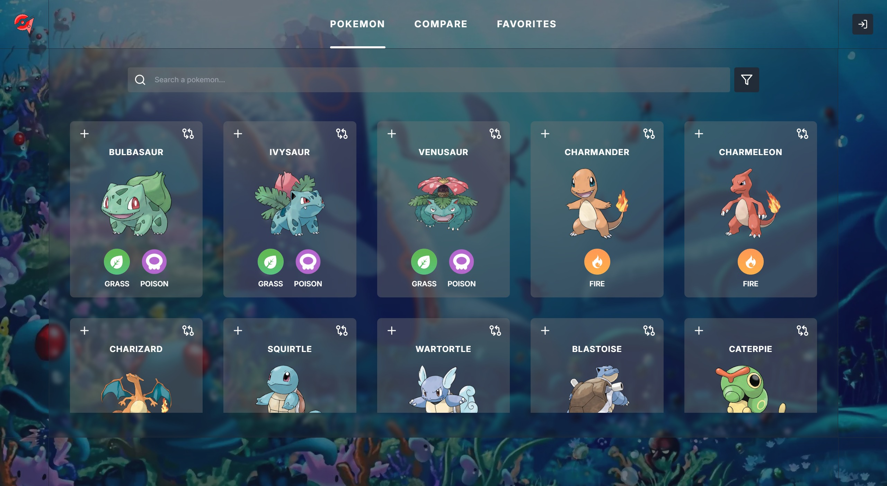

<div align="center">
  <p align="center"></p>
  <h1 style="border: none;">Pokedex</h1>
  <div>
    
    
    
  </div>
</div>

## 📋 <a name="table">Table of Contents</a>

1. 🤖 [Introduction](#introduction)
2. ⚙️ [Tech Stack](#tech-stack)
3. 🔋 [Features](#features)
4. 🤸 [Quick Start](#quick-start)

## <a name="introduction">🤖 Introduction</a>

Explore the world of Pokémon with comprehensive details on all generations. Use powerful filtering and searching capabilities to find exactly what you're looking for. Stay tuned for more features like favorite Pokémon saving and Pokémon comparison.
<br /><br />


## <a name="tech-stack">⚙️ Tech Stack</a>

- Next.js
- TypeScript
- TailwindCSS
- pokenode.ts
- Zustand
- Axios
- shadcn/ui

## <a name="features">🔋 Features</a>

👉 **Current Features**:
- Display all Pokémon from all generations with filtering and searching.
- View detailed descriptions, evolutions, moves, and encounter areas for each Pokémon.

👉 **Upcoming Features**:
- Login to save favorite Pokémon.
- Compare different Pokémon.

👉 **Development Best Practices**:
- Tailwind design with animations and effects for full responsiveness.
- State management using Zustand.
- API interaction using pokenode.ts and Axios.
- UI components built with shadcn/ui.
- Page loading state management.
- Responsive UI/UX for a seamless experience across devices.

and many more, including code architecture and reusability

## <a name="quick-start">🤸 Quick Start</a>

Follow these steps to set up the project locally on your machine.

**Prerequisites**

Make sure you have the following installed on your machine:

- [Git](https://git-scm.com/)
- [Node.js](https://nodejs.org/en)
- [npm](https://www.npmjs.com/) (Node Package Manager)

**Cloning the Repository**

```bash
git clone https://github.com/Firkhie/pokedex
cd pokedex
```

**Package Installation**

Install the project dependencies using npm:

```bash
npm i
```

**Running the Project**

```bash
npm run dev
```

Open [http://localhost:3000](http://localhost:3000) in your browser to view the project.

#
